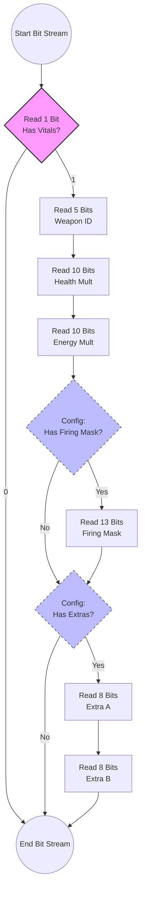

# Packet 0x18: Tank State

**Direction:** Server :right_arrow: Client (Likely)
**Opcode:** `0x18` (24)
**Size:** Variable (Depends on Vitals flags)

This packet updates the spatial and physical state of a specific tank unit (Unit Type) identified by a `Net ID`. It includes position, velocity, and optional "vitals" data (health, energy, weapon state) that are bit-packed for efficiency.

---

## Packet Structure

The packet consists of a fixed header, a variable-length bitfield section for stats, and a fixed tail for physics.

### 1. High-Level Layout

| Data Type | Field Name | Description |
| :--- | :--- | :--- |
| `byte` | **Header** | Always `0x18` |
| `int32` | **Timestamp** | Server ticks (synchronization) |
| `bits` | **Vitals Block** | *Variable length bit-stream (see below)* |
| `int32` | **Unit Type** | The hull/model ID of the tank |
| `int32` | **Net ID** | Unique Network ID of the object |
| `byte` | **Flags** | State flags (status effects, etc.) |
| `vec3` | **Position** | X, Y, Z world coordinates |
| `vec3` | **Velocity** | X, Y, Z motion vectors |

---

## 🧬 The Vitals Bit-Stream

This section is **bit-packed**. It starts with a single **Presence Bit**. If that bit is `0`, the parser skips to `Unit Type`. If `1`, it reads the following compressed data.

!!! warning "Implicit Schema"
    The **Firing Mask** and **Extras** fields do not have their own presence bits in the packet! The receiver must know to expect them based on the `tank_cfg` (likely tied to the `Unit Type`).

